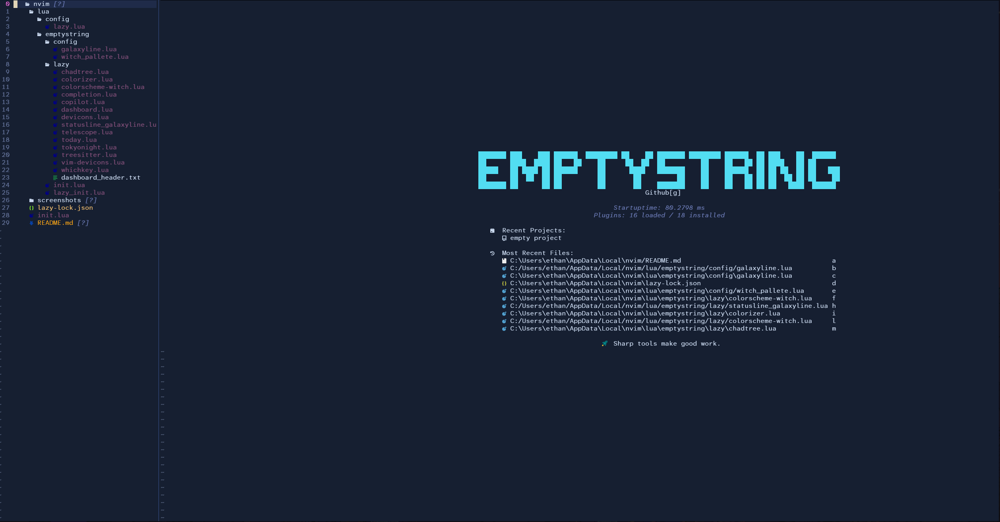
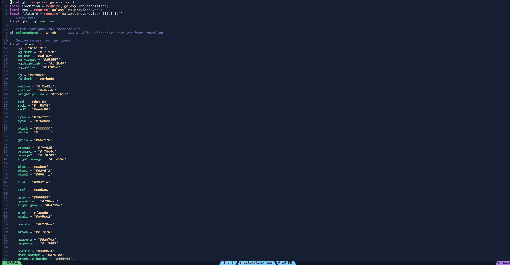
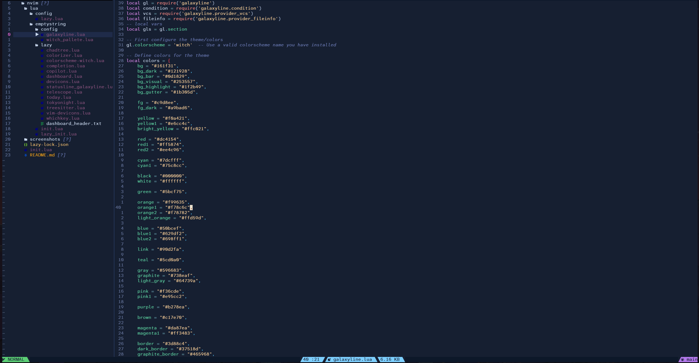

# EmptyStrings NeoVim config
This is a work in progress config but is a decent starting point.

# Screenshots
## Dashboard

## File Explorer

## Code

## Code with sidebar

# Plugins List
- [CHADtree](httpas://github.com/ms-jpq/chadtree) : File explorer
- [Coq](https://github.com/neovim/nvim-lspconfig) : Autocompletion
- [Copilot](https://github.com/github/copilot.vim) : AI rubber duck
- [Dashboard](https://github.com/glepnir/dashboard-nvim) : Dashboard
- [Devicons](https://github.com/ryanoasis/vim-devicons) : Icons
- [Galaxy Line](https://github.com/nvimdev/galaxyline) : Status line
- [telescope](https://github.com/nvim-telescope/telescope.nvim) : Fuzzy Finder
- [treesitter](https://github.com/nvim-treesitter/nvim-treesitter) : Syntax highlighting
- [whichkey](https://github.com/folke/which-key.nvim) : Keybinding helper

# TODO:
- [ ] fix colorizer
